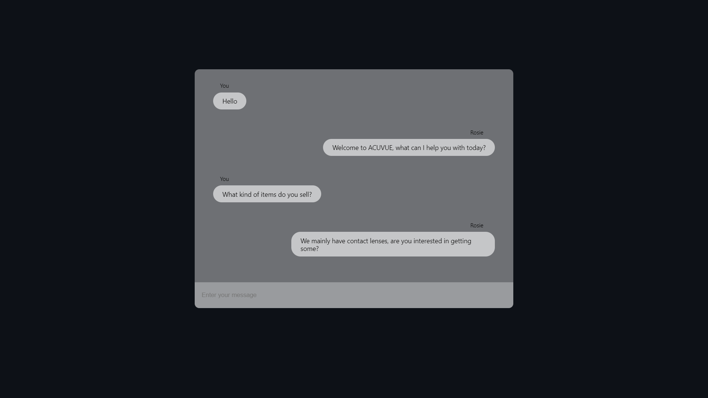

# Eye-SpiringChatbot

`Eye-SpiringChatbot` is a chatbot built for the [Eye-Spiring 2022](https://www.eyespiring.com/) hackathon. The chatbot is powered by Vue 3, Flask, PyTorch and NLTK to remotely evaluate a patient's compatibility for contact lenses.

<div align="center">
    
</div>

## Install

```bash
sh requirements.sh
```

## Usage

```bash
sh launch.sh
```

## Build

```bash
yarn run build
```
